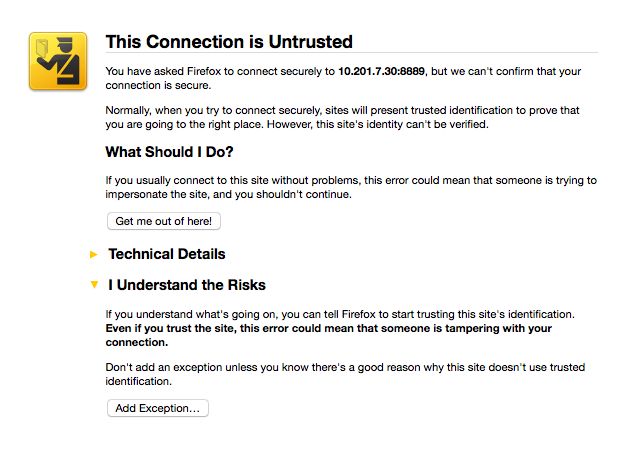

# Distributed data analysis

This workshop demonstrates some techniques for pre/post processing large 
data sets, which do not fit onto a single machine. While there are many 
methods to accomplish such a task, here we focus on the *map/reduce* (MR) 
paradigm through the  use of the [Spark framework](http://spark.apache.org). Spark is a "successor" to Hadoop with a rich API and properties attractive for data exploration. 

## The structure

The course is split into two hands-on components: 

* The first part consists of two sets of exercises demonstrating some features of the Python language useful for Spark applications and a brief introduction to using Spark. 
* The second part is a series of "mini-projects" analyzing a text corpus, in this case the Gutenberg books project, and a Twitter dataset. This second part is meant to be run remotely on a Hadoop cluster with an underlying Hadoop Distributed Filesystem (HDFS). 

I recommend that you do the tutorial exercises first before attempting the Gutenberg corpus notebooks!


### Programming knowledge

We assume fluency with basic programming constructs such as loops and functions. In the first session of the workshop, basics of functional programming and other python-specific constructs are introduced, as they are  useful for writing Spark applications. Knowing how to use the command line (or terminal) is also expected. 


### Python

The language used in the workshop is python. If you are not familiar with python at all, we recommend finding a basic tutorial and working through some examples before participating in the workshop. In particular, make sure that you understand the various python data types, such as strings, lists, tuples, dictionaries, and sets. We will go over some of these in the workshop, but you should at least try to use them in simple ways before going through the workshop material. 


### Git

I strongly recommend that you install [git](https://git-scm.com/) if  you don't have it installed already. To check if you have it on your machine, open up a terminal and type

```
$ git --version
```

If this returns something other than an error message, you are all set! 


### Firefox

We will be using the firefox browser to work interactively with the cluster in the last part of the workshop. We use Firefox because it allows us to set up a proxy without needing to change the system-wide proxy settings, i.e. this lets you continue using all other applications with the local connection instead of through the proxy. If you don't have Firefox already, you should install it - if you have it already installed, please make sure you update it to the latest version. 


## Setting up the local machine for hands-on tutorials

There are quite a few requirements for all the software used in this workshop to function properly. You can either install it all by hand (or perhaps you have it installed already), but if you don't want to bother with the set up, you can simply use the virtual machine option. 


* **Note for Windows users**: While ssh is a standard feature of linux and mac os x operating systems, it is not so on Windows. If you are running windows, you will therefore need to install a [PuTTY client](http://www.chiark.greenend.org.uk/~sgtatham/putty/download.html) or something similar that supports ssh tunneling*

### Easiest Setup: use a Virtual Machine

If you want to simply get up and running, then we recommend you use the 
workshop materials through the Virtual Machine (VM) environment set up specifically for this purpose. This way you will only have to deal with the minimal set of installations.

* install [Vagrant](https://www.vagrantup.com/downloads.html) (please upgrade to the latest version, if you have a previous installation already)
* install [VirtualBox](https://www.virtualbox.org/wiki/Download_Old_Builds_4_3) - **must be v4.3.x (4.3.28 is strongly recommended)**

If you have `git` on your machine (see above), then simply open up a terminal and clone this repository

```
$ git clone https://github.com/rokroskar/spark_workshop.git
$ cd spark_workshop
```

If you don't have git, [click to download the zip file](https://github.com/rokroskar/spark_workshop/archive/master.zip) and uncompress it somewhere on your hard-drive, e.g. 

```
$ unzip spark_workshop-master.zip
$ cd spark_workshop-master
```

Go to the `spark_workshop` directory and spin up the VM 

```bash
$ vagrant up
```

This will first download, configure, and boot the VM. The first time you do this, it has to download everything off the internet so it
will take a few minutes. You'll see lots of messages about packages being installed. Once it's finished, you should see something like 

```
==> spark_wkshp: Machine 'spark_wkshp' has a post `vagrant up` message. This is a message
==> spark_wkshp: from the creator of the Vagrantfile, and not from Vagrant itself:
==> spark_wkshp:
==> spark_wkshp: VM for Spark workshop is running -- login in with 'vagrant ssh'
```

To get started, you will need to log in to the VM:

```bash
$ vagrant ssh
```

To exit the VM

```
vagrant@spark-wkshp> logout
```

Then, to shut down the VM temporarily (to free up your machine's resources), you can do 
```
$ vagrant halt
```

Next time you call `vagrant up` it will resume from where you stopped and will not need to download all the packages again so it should only take ~30 seconds. 

To get rid of the VM completely

```
$ vagrant destroy
```


### Advanced setup 
If you want to run Spark from your own machine and you really want to do 
the setup yourself, or if you are an experienced user, you can follow 
the instructions below. These are useful for Mac OSX and Linux, but perhaps less so for Windows. 


#### Python dependencies

The notebooks used for the tutorials have been tested with Python 2.7. 
The python installation should have the following packages: <mark>numpy, scipy, scikit-learn, pip, ipython, jupyter, matplotlib</mark>

*Please note that we will be using the latest version of IPython (4.0) and the Jupyter notebooks. The notebooks developed for the workshop will not work with IPython < 3.0.*

If you are not sure how to meet these dependency requirements, we recommend 
that you [download the miniconda installer](http://conda.pydata.org/miniconda.html) appropriate for your system. Once it's installed, run the following commands: 

```
$ conda update conda 
$ conda install -y numpy scipy scikit-learn pip ipython jupyter matplotlib
```

We will also use a little package called `findspark` to simplify the setup a bit: 

```
$ pip install findspark
```

#### Java

Spark runs in a Java virtual machine, so you need to [install a Java distribution](https://java.com/en/download/). You might already have one on your machine, so first [check here](https://www.java.com/en/download/help/version_manual.xml).


#### Spark

Once you have Java installed, grab a spark hadoop 2.6 compiled binary package from http://spark.apache.org/downloads.html and extract it somewhere. Then create a symbolic link in your home directory to this location: 

    > ln -s /path/to/spark/package ~/spark
  
To make your life easier later on, add this line to your `.bashrc` (or whatever startup file is appropriate for the shell you are using): 

    export SPARK_HOME=~/spark

Now source the file you just added this line to, e.g. 

    > source .bashrc
  
and try to run a basic spark example to see if everything is working: 

    > $SPARK_HOME/bin/spark-submit $SPARK_HOME/examples/src/main/python/pi.py 10

## Using this material

Notebooks can be downloaded and run on a local machine or any spark cluster. 
The notebooks require IPython > 3.0. 

First, clone this repository on your local disk (if you set up the VM above, you've already done this):

```
$ git clone https://github.com/rokroskar/spark_workshop.git
```

Here, the instructions diverge briefly depending on whether you are running in a VM or your own installation:

### Using the VM (vagrant)

If the VM is not running, start it with `vagrant up`. 

Now we will launch the notebook server inside the VM

```
$ vagrant ssh -c "notebooks/start_notebook.py --setup --launch"
```

### Using your own installation

Simply setup/launch the notebook server from the `notebooks` directory

```
$ notebooks/start_notebook.py --setup --launch
```


### Back on the same page

From here the process is identical. The `start_notebook.py` script first sets up a secure notebook for you, so you will be prompted to enter a password (this is just for you, so pick anything you want). Finally, when it's finished you will see a message with something like this

```
[I 15:32:11.906 NotebookApp] The IPython Notebook is running at: https://[all ip addresses on your system]:8889/
[I 15:32:11.906 NotebookApp] Use Control-C to stop this server and shut down all kernels (twice to skip confirmation).
```

The number at the end of `https://[all ip addresses on your system]:8889/` is the port number on which the notebook is running. You can access it by simply going to https://localhost:8889 in your local browser. **Make sure you specify https and not just http!** This will bring up a menacing message like this



about an untrusted certificate (we created a self-signed certificate during the notebook setup). You can safely ignore this and either click "Advanced -> Proceed to localhost" (in Chrome) or "I understand the risks -> Add Exception" (in Firefox) or simply "Continue" (in Safari). 

Note that the `--setup` option is only needed the first time you start the 
notebook (to set up your SSL certificate and password) -- you can leave it out 
when starting the notebook server up again at some later point. 

The notebooks are organized in three directories: 

* [python_tutorial](https://github.com/rokroskar/spark_workshop/tree/master/notebooks/python_intro) - basic introduction to Big Data and python concepts
* [spark_tutorial](https://github.com/rokroskar/spark_workshop/tree/master/notebooks/spark_intro) - essential Spark skills
* [gutenberg](https://github.com/rokroskar/spark_workshop/tree/master/notebooks/gutenberg) - "project" notebooks building up an analysis of the Gutenberg books corpus

You should start by having a look at the python introduction notebook (where you can also execute cells) which introduces some essential python concepts. When you open the notebooks running on the notebook server (i.e. in your browser at `localhost:8889`), you can execute any cell in the notebook by entering `Shift+Enter`. You can also modify any of the cells to experiment. Once you're happy with the python introduction, continue on to the notebook marked "EMPTY" in the same directory and complete the exercises.  


## Outline
### Basics

* map/reduce/filter operations
* some python concepts that are useful for Spark
   * lambda functions
   * list comprehensions (generator expressions) 
   * generators (needed for mapPartitions)
   * key/value tuples

### Applying the basics in Spark
* description of Spark data and computation model (RDDs)
* different ways of running Spark apps 
   * local (i.e. laptop)
   * stand-alone (i.e. Euler)
   * YARN (Brutus cluster)
   * Amazon EC2
* map/reduce in Spark
   * intro to the computation graph
   * creating key, value RDDs
   * standard library functions (reduceByKey, aggregate, sortBy, etc.)

### Advanced
* optimizations/profiling
* writing aggregator classes

