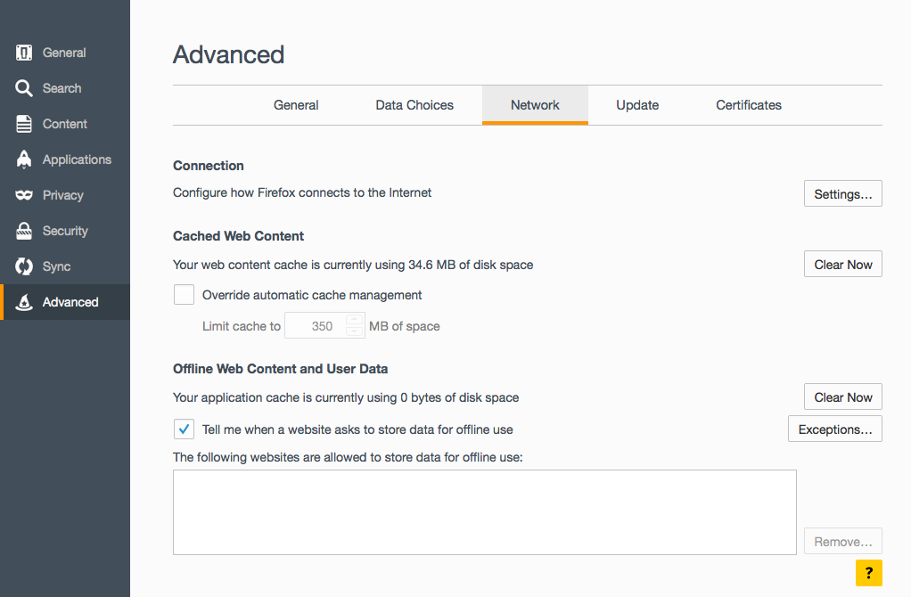
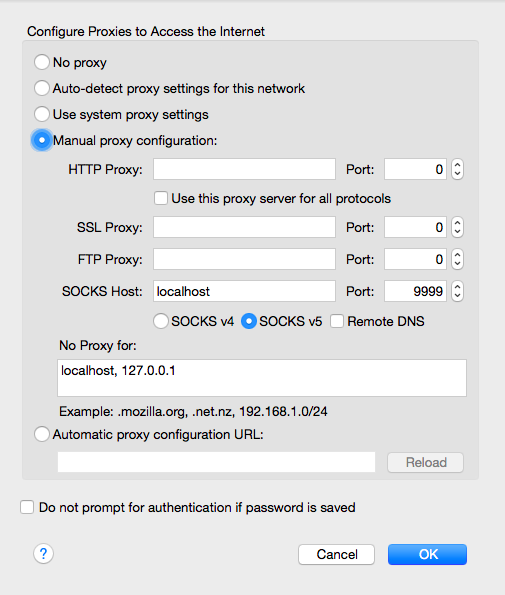
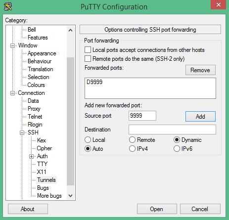

# Analyzing the Gutenberg Project book corpus

The [Gutenberg Project](https://www.gutenberg.org/) hosts books in the public domain in many languages. Here, we will first use the English book corpus to construct an "N-Gram viewer" and later we will combine this with the German book corpus to develop a language model. 

The corpus is about 10 Gb of raw html, which is not "Big Data" per-se but it is big enough that it is uncomfortable to analyze it on a laptop. Instead, we will do the analysis using Spark running on nodes controlled by a YARN resource manager. Our analysis will be done interactively by spawning a Jupyter notebook on the remote cluster and connecting to it from the comfort of a browser on the laptop.


## Cluster setup

There are a few things we need to get configured before we can use the cluster for our interactive analysis. 

Clone the repository:

```
$ ssh username@cluster
cluster~ $ git clone https://github.com/rokroskar/spark_workshop.git
```

where "username" is your username and "cluster" is the address of the cluster. 


### Configure cluster environment

```
cluster~ $ cd spark_workshop
cluster~/spark_workshop $ source scripts/setup_cluster.sh
```


### Configure the Jupyter Notebook

When the python installation process is complete, you can set up the jupyter notebook just like we did before on the laptop/VM: 

```
cluster~/spark_workshop $ notebooks/start_notebook.py --setup
```

Only run the setup part now -- we will launch it later from an interactive job running on one of the compute nodes of the cluster. 


## Setting up your laptop

A few special tricks are required also on the local side to enable an interactive experience with the cluster. 


### <a name="firefox-proxy"></a>Configuring the Firefox browser

Go to the `Settings` or `Preferences` --> `Advanced`, and click on `Network`: 



Click on `Settings` and configure the proxy settings as shown here: 



Now your Firefox browser's traffic is being routed through the cluster head node. This makes the otherwise inaccessible compute nodes available. 


### <a name="tunnel-setup"></a>Set up a secure tunnel to the cluster

In order to work with the cluster interactively, we need to set up a secure proxy to the cluster. Once this channel is open, we will then instruct the Firefox browser to direct all traffic over this secure channel. This way, we will be able to access our notebook that is running on the firewalled cluster. 


#### On Linux or Mac OS X

Open up the terminal/console and open a dynamic port forward to the cluster head node:

```
$ ssh -Nf -D 9999 username@cluster
```

You might be prompted for a password, but then nothing much will happen: the tunnel will work in the background and will remain active as long as you maintain an internet connection. This is especially nice if you have a long working session and you don't want to worry about accidentaly closing a terminal window. If you want the prompt for some reason, ommit the `-Nf` flags.

**Pro tip**: you can create an alias in your `.bashrc` to make this a bit easier, e.g. 

```
alias brutus_tunnel="ssh -Nf -D 9999 roskarr@brutus.ethz.ch" 
```

then all you need to do at the terminal is

```
$ brutus_tunnel
```

and it's all done. 


#### On Windows

Start up PuTTY and enter your cluster name into the host field. On the left, scroll down to "SSH" options and find "Tunnel". Check the "Dynamic" radio button, enter 9999 into the "Host Port" field and click "Add" so that the window shows "D9999". The filled-out options should look something like this: 




Then connect to the host and enter your user credentials. You must keep the PuTTY window open to maintain the connection. 


## Putting it all together

Now we have a tunnel to the cluster, Firefox is set up to communciate with the cluster via the tunnel, and the notebook on the cluster side is configured. All we need is an interactive job to run the driver program and we are set. 


### Obtain an interactive job on the cluster

Every Spark job consists of a driver application and tasks running on executors. The driver orchestrates the flow of the analysis and can sometimes consume significant resources. When we run applications in interactive mode, it is therefore imperative to first obtain resources for the driver, and then use it to start the Spark job. 


We obtain resources by requesting an interactive job in the normal job queue on the HPC cluster. In LSF, this is done with a line like

```
cluster~ $ bsub -Is -W 4:00 -n 2 bash
```

After a brief while (hopefully not longer than a minute or two) the system will grant us the job and we will be given a bash prompt on one of the compute nodes, i.e. something like 

```
Generic job.
Job <94883470> is submitted to queue <pub.1h>.
<<Waiting for dispatch ...>>
<<Starting on a6583>>
a6583~ $ 
```


First, make sure your python environment is set up correctly by sourcing the `setup_cluster.sh` script in the `spark_workshop` directory. Then we can launch the jupyter notebook using the same script as before

```
a6583~ $ cd spark_workshop
a6583~ $ source scripts/setup_cluster.sh
a6583~ $ notebooks/start_notebook.py --launch

To access the notebook, inspect the output below for the port number, then point your browser to https://10.201.7.30:<port_number>
[I 22:30:09.555 NotebookApp] Serving notebooks from local directory: /cluster/home03/sdid/roskarr/spark_workshop
[I 22:30:09.556 NotebookApp] 0 active kernels
[I 22:30:09.556 NotebookApp] The IPython Notebook is running at: https://[all ip addresses on your system]:8889/
[I 22:30:09.556 NotebookApp] Use Control-C to stop this server and shut down all kernels (twice to skip confirmation).
```

Now you can open the Firefox browser on your laptop, which should be [configured to use a proxy](#firefox-proxy) through an [ssh tunnel](#tunnel-setup) and point it to the IP address printed in bold on the screen, i.e. https://10.201.7.30:8889 in this case (the IP address and port might be different every time).


After the usual warnings about the SSL Certificate, which you can safely ignore, you'll be prompted for your notebook password and that's it! Navigate to the `notebooks/gutenberg` directory and open up the `part1-preprocessing-EMPTY.ipynb` notebook to get started. 

