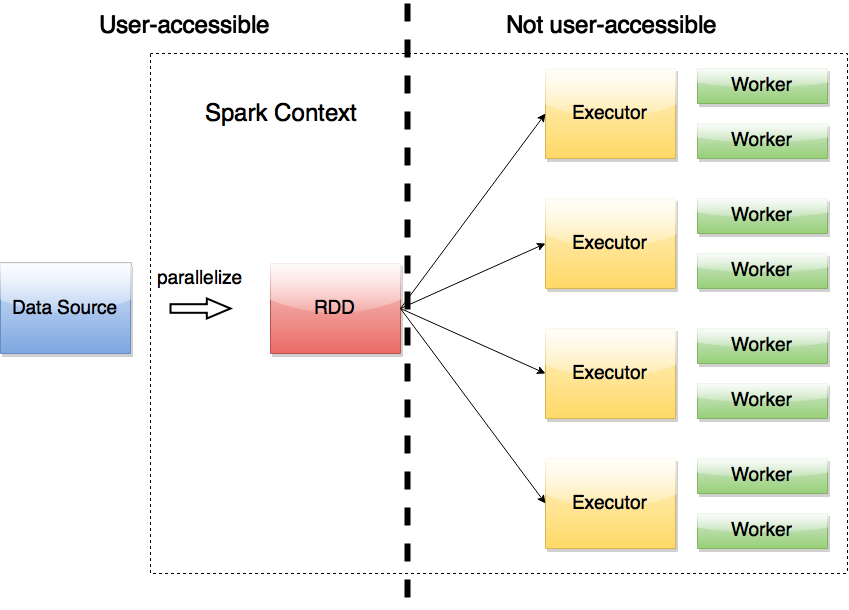
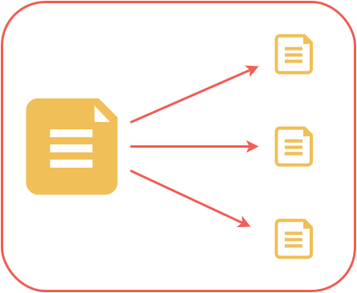
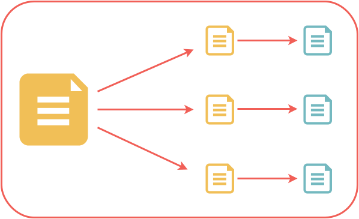

# Getting started with...


In the [previous session](../intro/Spark_workshop_Introduction.ipynb) we discussed some basics of the map/reduce programming paradigm. 

Now, we'll see how we can "scale up" these ideas to distribute the workload among many machines.

For this, we will use [Spark](http://spark.apache.org), a distributed computing framework that fits nicely into 
the [Apache Hadoop](http://hadoop.apache.org) ecosystem.


## Basic Data Abstraction: the Resilient Distributed Dataset

An RDD is the essential building block of every Spark application. 

* keeps track of data distribution across the workers  
* provides an interface to the user to access and operate on the data
* can rebuild data upon failure
* keeps track of lineage 
* ** is immutable **

** As a Spark user, you write applications that feed data into RDDs and subsequently transform them into something useful **


## Spark Architecture Overview

A very abbreviated and naive description of how Spark works: 

The runtime system consists of a **driver** and **workers** (there are more specific components like schedulers and memory managers, but those are details). 

**Driver**

* coordinates the work to be done  
* keeps track of tasks
* collects metrics about the tasks (disk IO, memory, etc.) 
* communicates with the workers (and the user) 

**Workers**  

* receive tasks to be done from the driver
* store data in memory or on disk
* perform calculations
* return results to the driver

The user's access point to this Spark universe is the **Spark Context** which provides an interface to generate RDDs. 

** The only point of contact with the Spark "universe" is the Spark Context and the RDDs via the driver **


### The Spark Architecture

(in a very abbreviated form) 





## Flexibility of Spark runtime

A few points before we get our feet wet with doing some basic data massaging in Spark. 

The spark runtime can be deployed on: 
* a single machine (local)
* a set of pre-defined machines (stand-alone)
* a dedicated Hadoop-aware scheduler (YARN/Mesos )
* "cloud", e.g. Amazon EC2 

The development workflow is that you start small (local) and scale up to one of the other solutions, depending on your needs and resources. 

In addition, you can run applications on any of these platforms either

* interactively through a shell (or an ipython notebook as we'll see)
* batch mode 

** Often, you don't need to change *any* code to go between these methods of deployment! **


##RDD transformations and actions

Once an RDD is created, it is **immutable** - it can only be modified via a *transformation*

Transformations include: 
* `map` -- the most basic component of map/reduce with 1:1 correspondence to original data
* `flatMap` -- returns a number of items different from the original data
* `filter` -- only keep those elements for which the filter function evaluates to `True`
* `distinct` -- only retain the unique elements of the entire RDD
* `reduceByKey` -- group elements by key and keep the data distributed 
* `mapPartitions` -- similar to `map` but done on a per-partition basis (requires a generator function)
* `sortBy` -- sort using the provided function

Transformations are evaluated "lazily" - only executed once an *action* is performed. 


Actions include: 
* `collect` -- pulls all elements of the RDD to the driver (often a bad idea!!)
* `collectAsMap` -- like `collect` but returns a dictionary to the driver which makes it easy to lookup the keys 
* `reduce` -- reduces the entire RDD to a single value
* `countByKey`/`countByValue`
* `take` -- yields a desired number of items to the driver
* `first` -- returns the first element of the RDD to the driver -- very useful for inspecting the data!


## Lineage

* When an RDD is transformed, this **transformation** is not automatically carried out. 
* Instead, the system remembers how to get from one RDD to another and only executes whatever is needed for the **action** that is being done. 
* this allows one to build up a complex "pipeline" and easily tweak/rerun it in its entirety 


### Parallelize
```python
rdd = sc.parallelize(data)
```



### Map
```python
rdd = sc.parallelize(data)
rdd2 = rdd.map(function)
```



## Partitioning

* data of each RDD is partitioned and each partition is assigned to an executor
* each partition in a transformation results in a task
* there may be many more tasks than cores in the system, which allows for good utilization by fine-graining the overall load.


## Caching 

* RDD evalutations are *lazy* 
* whenever an action is performed, the entire lineage graph is recalculated
* unless! an intermediate RDD is cached -- then it is only calculated once and reused from memory each subsequent time
* this allows for good performance when iterating on an RDD is required 


### A typical execution path

Spark separates execution into stages consisting of many narrow dependencies between partitions. 

** Narrow ** : `map`, `filter`

** Wide ** : `join`, `groupBy`

If some parts of the RDD were to be lost due to executor failure, the missing pieces are automatically recomputed via the appropriate stages. 

Here we have a few things going on: 

* the elements of RDD $A$ are grouped by key yielding RDD $B$
* $C$ is mapped to $D$ and unioned with $E$ resulting in $F$
* $B$ and $F$ are joined together


    
