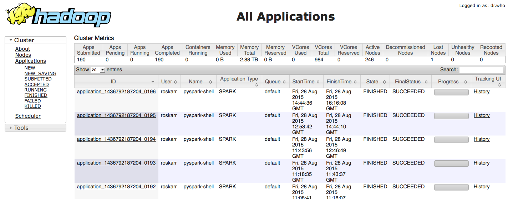

# Distributed Data Analysis  

(for scientists) <!-- .element: style="font-size:75%;text-align:center" -->

### Scientific IT Services // ETH Zürich

## Purpose

What are we doing here? 

* presumably, you have some sort of a "data problem"
* you live in constant fear that your "data problem" will outgrow even your group's new shiny workstation
* you do some work in the batch queue of a cluster, but you find this limiting and rigid
* you've heard of "big data" tools, but it always seems like such a pain to get going with them

Hopefully we'll be able to address some of these problems!

### Who am I? 

* Rok Roškar --> I work for the SIS Research Informatics group
* background (PhD) in theoretical astrophysics -- spent many years running large simulations on supercomputers
* dove into "big data" tools about a year ago, trying to come up with a solution for a D-GESS project

## Big Data 
### Everyone is talking about it... but no one knows what it is

1 Gb? 50 Gb? 500 Gb? 500 Tb? 1 Pb? <!-- .element: style="text-align:center" -->

It doesn't matter! <!-- .element: style="text-align:center;font-weight:bold" class="fragment" data-fragment-index="1"-->

* "Big data" is when you start to seriously worry that your analysis will never complete <!-- .element: class="fragment" data-fragment-index="2" -->
* this could be due to memory or runtime <!-- .element: class="fragment" data-fragment-index="2" -->
* good news: lots of people are doing it --> can't be that hard! <!-- .element: class="fragment" data-fragment-index="2" -->

## *Data exploration enables scientific discovery*
Big or small data isn't the point: we want to enable scientific discovery <!-- .element: class="fragment" data-fragment-index="1" -->

This happens through efficient data exploration, irrespective of size <!-- .element: class="fragment" data-fragment-index="2" -->

Static batch pipelines (think endless scripts) <!-- .element: class="fragment" data-fragment-index="3" -->

vs. flexible, interactive, visual analysis <!-- .element: class="fragment" data-fragment-index="4" style="text-align:right"-->

### Unfortunately, data outgrows resources rather quickly...

#### ... so we have to try and "scale" our workflows <!-- .element: class="fragment" data-fragment-index="1" -->

<!-- .slide: data-background="figs/laptop_workstation.svg" data-background-size="contain" -->
### First try: move from laptop to a workstation 

* more memory! problem solved? handled by operating system...
* more cores! special libraries can provide simple multithreading support
* still, we want analysis on Tb of data at interactive speeds! 

*Obtain results* of a model within seconds of changing a parameter; 

*discover relationships* in high-dimensional data by slicing, dicing, reducing, visualizing

A single workstation will not cut it, and if it does for a problem today, it certainly won't tomorrow. 

<!-- .slide: data-background="figs/cluster-computing.svg" data-background-size="contain" -->

<!-- .slide: data-background="figs/cluster-computing.svg" data-background-size="contain"  data-state="background-blur-animation"-->
### Next, move to a *cluster* 

* a set of interconnected servers steered through some common gateway <!-- .element: class="fragment" data-fragment-index="1" -->
* easy for "embarrasingly" parallel work-loads <!-- .element: class="fragment" data-fragment-index="1" -->
* book-keeping nightmare (tons of files, but helped with workflow managers) <!-- .element: class="fragment" data-fragment-index="1" -->
* not so easy for really parallel computation <!-- .element: class="fragment" data-fragment-index="1" -->
* definitely not easy for interactive use and data exploration <!-- .element: class="fragment" data-fragment-index="1" -->

What's so hard about distributed analysis/computation? 

* data and tasks need to be *coordinated* between the different machines
* consumption of data and production of results has to be controlled
* partial results calculated on various parts of the system need to be assembled for the user
* in a "true" parallel environment, this is done via very complicated sequences of communication library calls
* no longer have one machine but many, potentially hundreds --> hard to debug/control!

## Liberation through limitation

General multiprocessing/parallel libraries (e.g. MPI)
* give the user a lot of control and flexibility
* they are *very* hard to use and debug!
* not great for fast turn-around of home-grown code!

<h4 class="fragment visible" data-fragment-index="0">What if we only allowed the user a very rigid programming model?</h4>

<ul style="text-align:left" class="fragment visible" data-fragment-index="0">
<li>more robust out-of-the-box</li>
<li>predictable</li>
<li>easier to monitor, discover failures etc.</li>
</ul>

<!-- .slide: data-background="figs/mapreduce.svg" data-background-size="contain" -->

<!-- .slide: data-background="figs/mapreduce.svg" data-background-size="contain" data-state="background-blur-animation"-->
####**MapReduce** is such a programming paradigm

* not just the combination of map and reduce tasks...
* fault-tolerance (expect nodes to go down all the time)
* data replication
* data locality

### We all know this to some extent --> it's all around us 

* Web 2.0 <!-- .element class="fragment" data-fragment-index="2" -->
    * multimedia content (images, video, music/audio) 
    * recommendation engines (shopping, movies, ads. etc.) 
* Sensors <!-- .element class="fragment" data-fragment-index="3" -->
    * smartphone 
    * real-world, internet of things 
* Public infrastructure <!-- .element class="fragment" data-fragment-index="4" -->
    * telecom
    * transportation (trains, traffic)
* Science <!-- .element class="fragment" data-fragment-index="5" -->
    * CERN 
    * astronomy sky surveys
    * translational medicine
    
Many of these "production" systems based on MapReduce combined with efficient "data stores" (distributed databases etc) <!-- .element class="fragment" data-fragment-index="6" -->

<!-- .slide: data-background="figs/datacenter.svg" data-background-size="300px"  data-state="background-blur" data-background-repeat="repeat"-->
### modern data centers consist of 1000s of machines

<ul style="text-align:left" class="fragment visible" data-fragment-index="0">
<li> data movement is critical and often most expensive   </li>
<li> often, this is "commodity" hardware (not like our Brutus/Euler)</li>
<li> network between machines might be sluggish </li>
<li> bring computation/algorithm to the data</li>
</ul>

## Where are we in all of this? 

### Typical academic computing landscape

1. individual workstations/laptops
2. group/lab/institute resources
3. University-wide computing infrastructure, usually geared for HPC

<h3  class="fragment visible" data-fragment-index="0">Some issues</h3>

<ol class="fragment visible" data-fragment-index="0">
<li>first two are hard to scale and/or expensive to buy/maintain</li>
<li>HPC not geared for interactive analysis (exceptions: some matlab functionality, R and Python parallelization w/ MPI, specialized domain-specific analysis codes)</li>
</ol>

## What we are trying to do

### We see a need for scalable analysis in many fields! <!-- .element class="fragment" data-fragment-index="0" style="text-align:center"-->

#### Could "Big Data" tools lend a hand? <!-- .element class="fragment" data-fragment-index="1" style="text-align:center"-->

#### Is there a Big Data need? <!-- .element class="fragment" data-fragment-index="1" style="text-align:center"-->

## "Big Data" software stack

* big data tools --> Hadoop ecosystem under Apache (Hadoop, Pig, Hive, Mahout, etc.)
* a whole zoo of tools for various stages of data processing
* stable, reliable, used in businesses all over the world daily

<ul class="fragment visible" data-fragment-index="0">
<li>a pain to use, not easy to set up, requires specialized configurations</li>
<li>Hadoop handles fault tolerance by dumping all intermediate results to disk and replicating; lots of I/O at every stage</li>
<li>heavy use of Java...</li>
</ul>

<!-- .slide: data-background="http://spark.apache.org/images/spark-logo.png" data-background-size="contain" data-state="background-blur"-->
## Enter... Spark

### a general-purpose distributed computation framework 

* performs calculations using a directed acyclic graph (DAG) instead of strictly map and reduce stages <!-- .element class="fragment" data-fragment-index="1" -->
* DAG allows for in-memory caching and fault-tolerance without disk I/O <!-- .element class="fragment" data-fragment-index="2" -->
* does not require specialized infrastructure, can run without Hadoop/HDFS <!-- .element class="fragment" data-fragment-index="4" -->
* has a rich feature-set to make programming easier (in Scala, Java, Python, R) <!-- .element class="fragment" data-fragment-index="5" -->
* includes a machine learning library with increasingly useful features <!-- .element class="fragment" data-fragment-index="6" -->
* the most active Apache BD project <!-- .element class="fragment" data-fragment-index="7" -->
* heavy industry backing - IBM commited 3500 (!?) developers to open source effort worldwide, dozens of other companies contributing <!-- .element class="fragment" data-fragment-index="8" -->

## The status and the plan

* we have developed some prototype deployments of the "big data stack" on existing HPC infrastructure
* two possibilities: 
  1. dedicated hadoop cluster on Brutus 
  2. batch queues on Brutus or Euler

### Hadoop cluster on Brutus 

* ~250 nodes out of service contract 
* 4 cores, 4 Gb/core, 1 Tb disk
* In total, 1000 cores, ~250 Tb HDFS and ~3 Tb application RAM **dedicated** to this use-case

### "standalone" Spark on Brutus/Euler batch queue

* run through the batch queue
* deploy a "standalone" Spark cluster each time on assigned nodes (simple with some generic scripts)
* access to newer hardware, more resources, but also resource contention

### Some goals for the next few days

* get an intuition for working on data in a distributed way (where is my data? how do I compute on it?)
* get an introduction to "big data" tools, notably HDFS and Spark
* become familiar with how to use these tools on currently available resources
* get ideas for your own workflows/projects

### Outline

* python intro (day 1)
* Map/Reduce, functional programming, intro to Spark (day 1)
* Processing the Gutenberg corpus with Spark on Brutus (day 2)
* Analyzing Twitter with Spark DataFrames (day 3)
